## Sommaire

:::: {.columns}
::: {.column width="25%"}
::: {.sommaire-card}
### 01 — Contexte
Périmètre, sources de données et questions structurantes
:::
:::
::: {.column width="25%"}
::: {.sommaire-card}
### 02 — Activité
CA, produits, clients, transactions, références
:::
:::
::: {.column width="25%"}
::: {.sommaire-card}
### 03 — Clients
Concentration, fidélisation, RFM, rétention
:::
:::
::: {.column width="25%"}
::: {.sommaire-card}
### 04 — Corrélations & Décisions
Comportements d'achat, synthèse, recommandations
:::
:::
::::

## Contexte & objectifs de l'analyse

:::: {.columns}
::: {.column width="58%"}
**Lapage** est une librairie e-commerce dont nous analysons **2 ans d'activité** pour identifier les leviers de croissance et les profils clients prioritaires.

**3 questions structurantes :**

- Comment évolue l'activité dans le temps ?
- Quels produits et clients génèrent la valeur ?
- Le profil client influence-t-il le comportement d'achat ?
:::
::: {.column width="42%"}
### Périmètre de l'analyse

- **Période** — Mars 2021 – Février 2023
- **Sources** — Clients, produits, transactions
- **Catalogue** — 3 catégories de livres
- **Clientèle** — BtoC & BtoB
:::
::::

## +24 mois de hausse — la croissance est portée par le volume, le panier moyen reste stable

:::: {.columns}
::: {.column width="50%"}
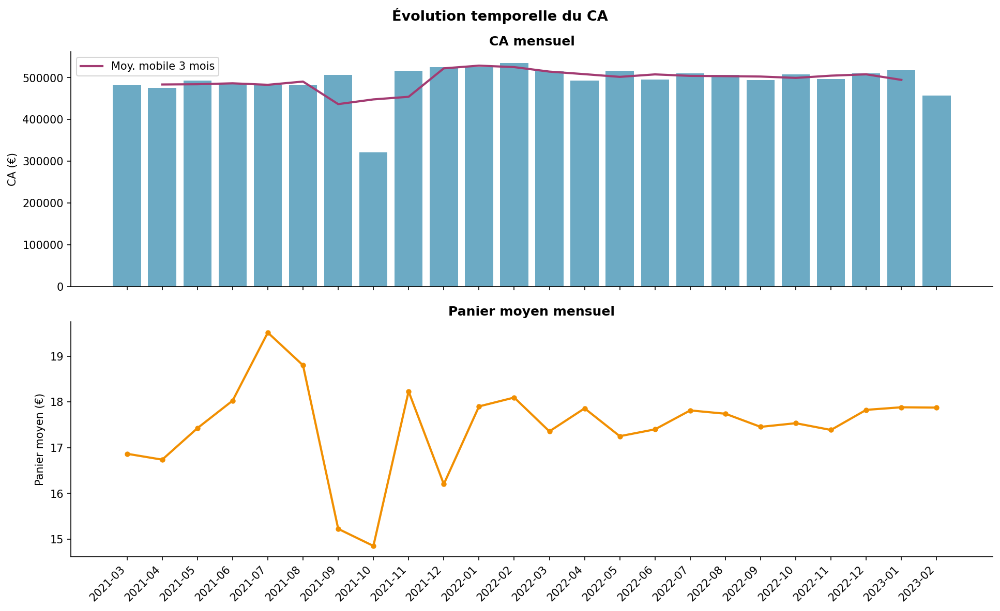{width=100%}
:::
::: {.column width="50%"}
### Chiffre d'affaires mensuel

- Tendance **haussière** sur 2 ans
- Saisonnalité **marquée** et reproductible
- Panier moyen **stable** — croissance portée par le volume
:::
::::

## 1 catégorie concentre la majorité du CA — une dépendance structurelle à réduire

:::: {.columns}
::: {.column width="50%"}
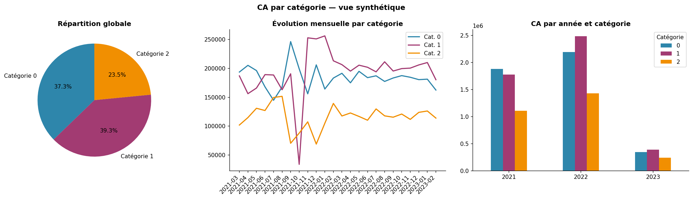{width=100%}
:::
::: {.column width="50%"}
### Répartition par catégorie

- Catégorie 0 — **majorité structurelle** du CA
- Catégories 1 et 2 — secondaires, peu différenciées
- Dépendance forte à une seule catégorie
:::
::::

## Récurrents majoritaires — la base clients est stable, la fidélisation fonctionne

:::: {.columns}
::: {.column width="50%"}
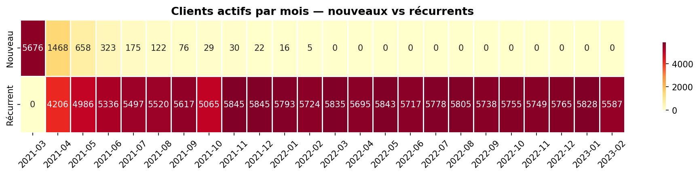{width=100%}
:::
::: {.column width="50%"}
### Clients actifs mensuels

- Base active **stable** sur toute la période
- Majorité de clients **récurrents**
- Fidélisation fonctionnelle
:::
::::

## Transactions ∝ CA sur 24 mois — aucun effet prix dissocié détectable

:::: {.columns}
::: {.column width="50%"}
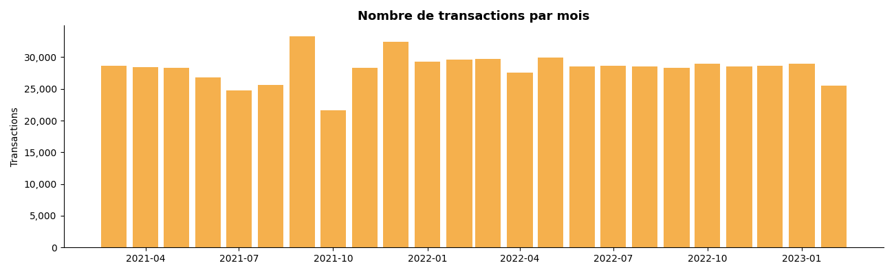{width=100%}
:::
::: {.column width="50%"}
### Volume de transactions

- Volume corrélé au CA — **pas d'effet prix dissocié**
- Saisonnalité cohérente avec le CA
:::
::::

## Rotation constante — la même fraction du catalogue est active chaque mois

:::: {.columns}
::: {.column width="50%"}
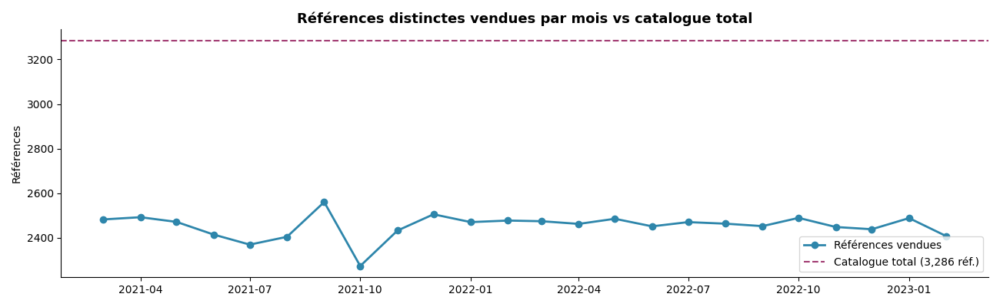{width=100%}
:::
::: {.column width="50%"}
### Rotation du catalogue

- Nombre de références actives **stable**
- Fraction **constante** du catalogue écoulée chaque mois
:::
::::

## Top 10 vs Flop 10 — un écart de CA massif, le catalogue doit être trié

:::: {.columns}
::: {.column width="50%"}
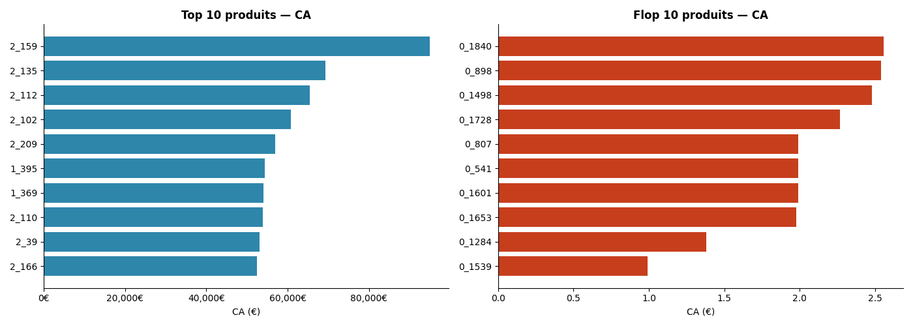{width=100%}
:::
::: {.column width="50%"}
### Concentration produits

- Écart **significatif** entre best-sellers et queue de catalogue
- Les 10 premiers produits concentrent l'essentiel du CA
:::
::::

## Pareto confirmé : 20% des références → 80% du CA

:::: {.columns}
::: {.column width="50%"}
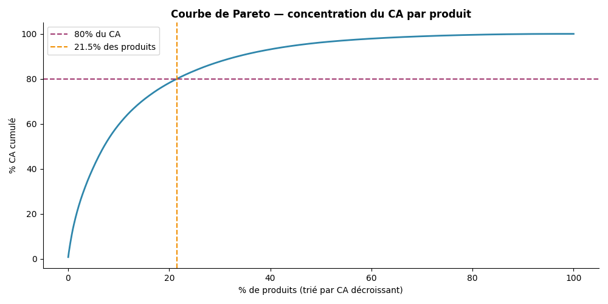{width=100%}
:::
::: {.column width="50%"}
### Pareto 80/20

- **20 %** des références → **80 %** du CA
- Assortiment optimisable en concentrant sur les références motrices
:::
::::

## BtoB : quelques clients, l'essentiel du CA — risque de concentration critique

:::: {.columns}
::: {.column width="50%"}
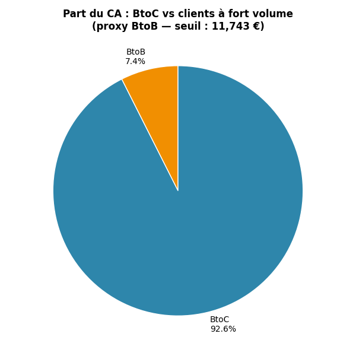{width=100%}
:::
::: {.column width="50%"}
### Segment BtoB

- Segment **restreint**, part **disproportionnée** du CA
- Risque de concentration élevé — à sécuriser en priorité
:::
::::

## Gini élevé — le CA est très concentré sur un petit nombre de clients

:::: {.columns}
::: {.column width="50%"}
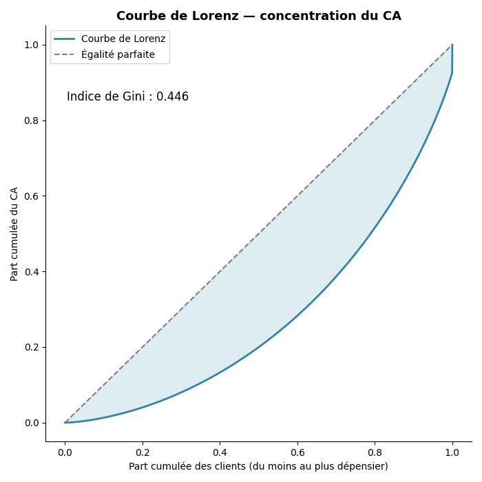{width=100%}
:::
::: {.column width="50%"}
### Inégalité de répartition

- Coefficient de Gini **élevé**
- CA très concentré sur un **petit nombre** de clients
:::
::::

## Top 20 : 4 clients se démarquent nettement — enjeu stratégique prioritaire

:::: {.columns}
::: {.column width="50%"}
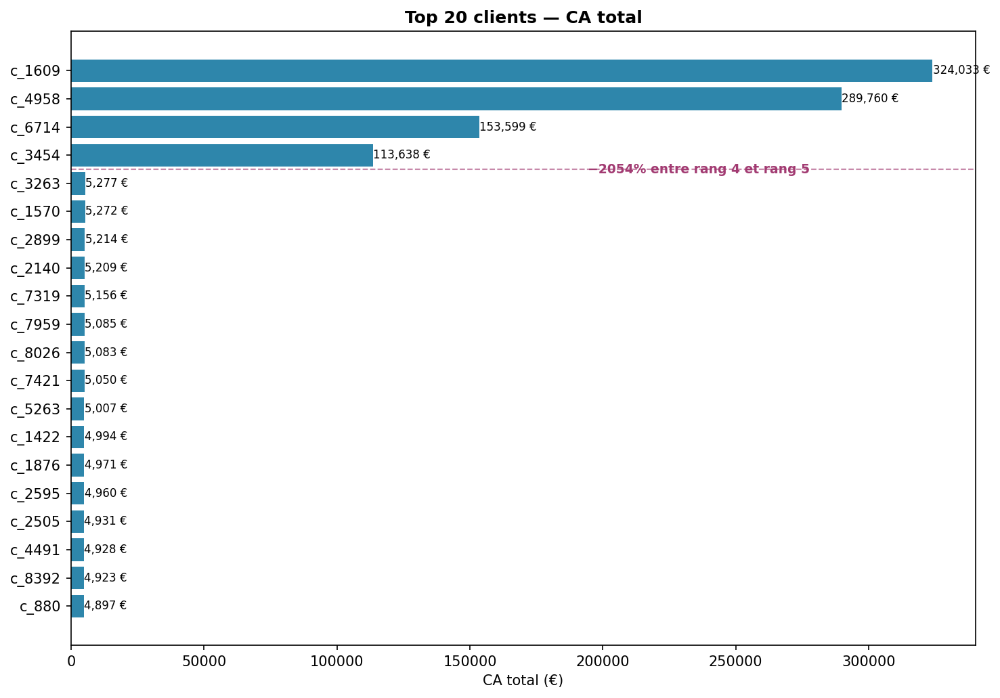{width=100%}
:::
::: {.column width="50%"}
### Top 20 clients

- **Décrochage net** entre les 4 premiers et le reste
- Ces 4 clients = enjeu stratégique à part entière
:::
::::

## Clients one-shot : 1 achat, jamais revenus — levier d'activation direct

:::: {.columns}
::: {.column width="50%"}
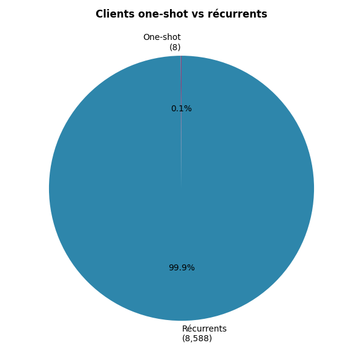{width=100%}
:::
::: {.column width="50%"}
### Taux de fidélisation

- Part **significative** de clients achetant une seule fois
- Segment one-shot = **levier d'activation direct**
:::
::::

## Fréquence × valeur — le CA croît linéairement avec la récurrence

:::: {.columns}
::: {.column width="50%"}
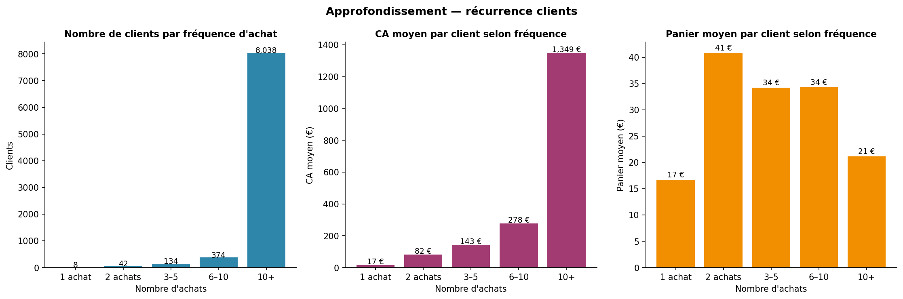{width=100%}
:::
::: {.column width="50%"}
### Valeur de la récurrence

- CA total **croît linéairement** avec la fréquence
- Fidélisation directement et **linéairement** rentable
:::
::::

## RFM : 4 profils distincts — des actions commerciales différenciées par segment

:::: {.columns}
::: {.column width="50%"}
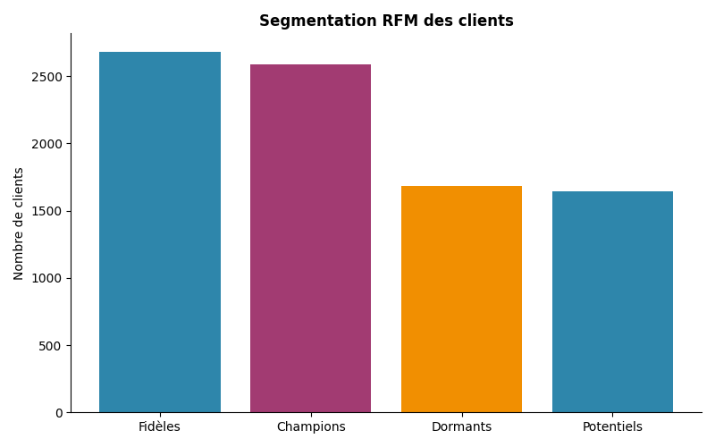{width=100%}
:::
::: {.column width="50%"}
### RFM (Recency · Frequency · Monetary)

- Clients à fort potentiel, à risque, inactifs — **identifiés**
- Chaque segment appelle une **action commerciale spécifique**
:::
::::

## Rétention : chute dès le 2e mois — J+30 est le moment critique à adresser

:::: {.columns}
::: {.column width="50%"}
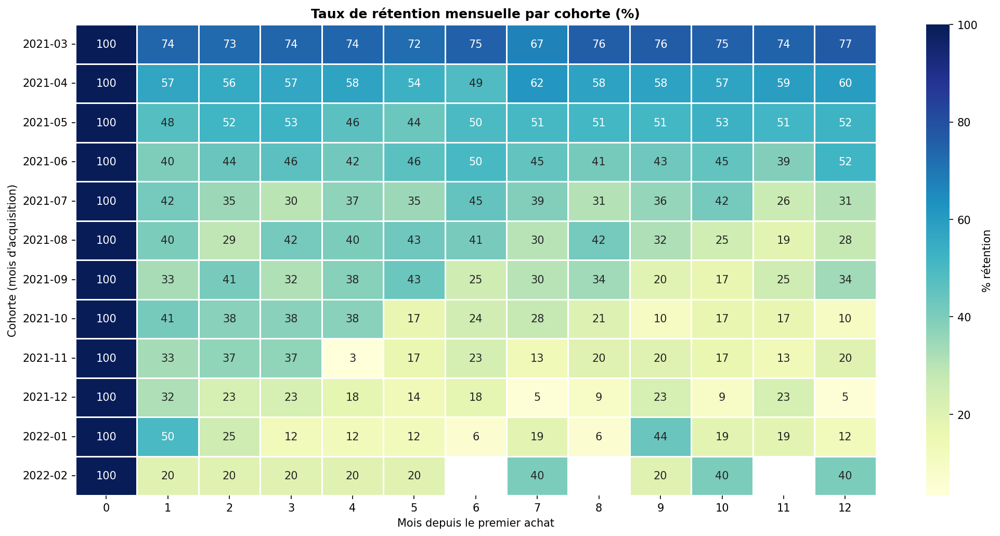{width=100%}
:::
::: {.column width="50%"}
### Analyse de cohortes

- Rétention **chute fortement** dès le 2e mois
- 1er mois post-acquisition = **moment critique** à adresser
:::
::::

## Chi² non significatif — le genre ne détermine pas la catégorie achetée

:::: {.columns}
::: {.column width="50%"}
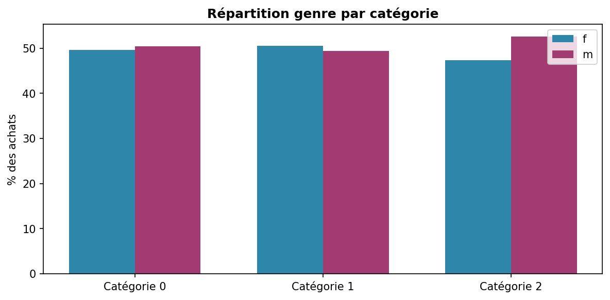{width=100%}
:::
::: {.column width="50%"}
### Test Chi² d'indépendance

- Le genre **n'influence pas** la catégorie achetée
- Segmentation par genre : **non pertinente** pour le ciblage
:::
::::

## Chi² non significatif — l'âge ne détermine pas la catégorie achetée

:::: {.columns}
::: {.column width="50%"}
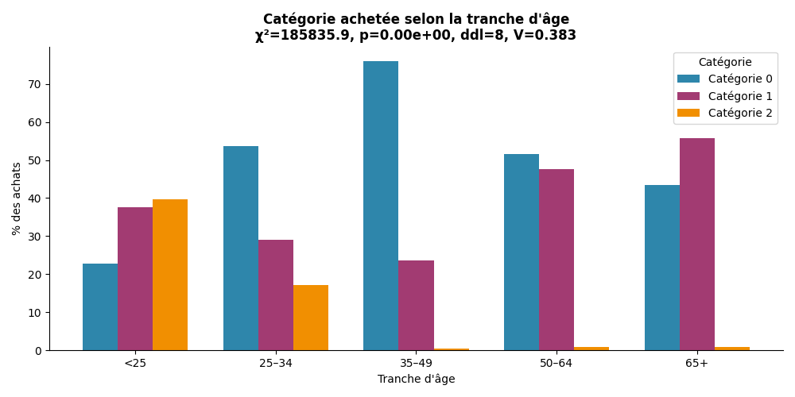{width=100%}
:::
::: {.column width="50%"}
### Test Chi² d'indépendance

- La tranche d'âge **n'influence pas** la catégorie achetée
- Segmentation par âge sur les catégories : **invalidée**
:::
::::

## r ≈ 0 — l'âge ne prédit pas le CA total

:::: {.columns}
::: {.column width="50%"}
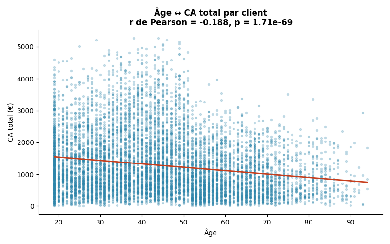{width=100%}
:::
::: {.column width="50%"}
### Corrélation de Pearson

- Corrélation **nulle** entre âge et CA total
- L'âge **ne prédit pas** la valeur client
:::
::::

## r ≈ 0 — l'âge ne prédit pas la fréquence d'achat

:::: {.columns}
::: {.column width="50%"}
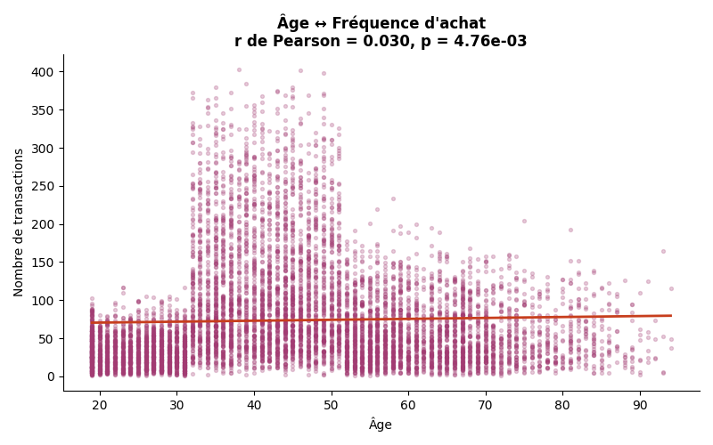{width=100%}
:::
::: {.column width="50%"}
### Corrélation de Pearson

- Aucune relation entre âge et fréquence d'achat
- **Profil démographique** : non prédictif du comportement
:::
::::

## r ≈ 0 — l'âge ne prédit pas le panier moyen

:::: {.columns}
::: {.column width="50%"}
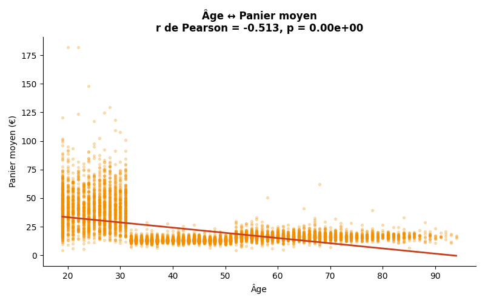{width=100%}
:::
::: {.column width="50%"}
### Corrélation de Pearson

- Aucune relation entre âge et panier moyen
- La **récurrence** prime sur le profil démographique
:::
::::

## Synthèse — Principaux enseignements

:::: {.columns}
::: {.column width="50%"}
**Activité**

- ✅ CA en croissance, saisonnalité identifiable
- ⚠️ Dépendance structurelle à la catégorie 0
- ⚠️ 20 % des produits font 80 % du CA

**Clients**

- ✅ Base récurrente solide
- ⚠️ CA très concentré — risque BtoB élevé
- ⚠️ Rétention faible dès le 2e mois
:::
::: {.column width="50%"}
**Corrélations**

- ℹ️ L'âge ne prédit ni le CA, ni la fréquence, ni le panier
- ℹ️ Genre et âge ont un effet limité sur les catégories

**Signal fort**

- 🎯 La valeur client est déterminée par la **récurrence**, pas par le profil démographique
:::
::::

## Recommandations — 5 actions prioritaires

:::: {.columns}
::: {.column width="50%"}
::: {.kpi-box}
🔴 **1 — Sécuriser le BtoB**
Suivi dédié, contrats cadres
*Lorenz + top clients*
:::

::: {.kpi-box}
🔴 **2 — Activer les one-shot**
Relance ciblée J+30
*Cohortes + RFM*
:::

::: {.kpi-box}
🟠 **3 — Concentrer l'assortiment**
Focus sur les 20 % de références motrices
*Pareto + top produits*
:::
:::
::: {.column width="50%"}
::: {.kpi-box}
🟠 **4 — Diversifier hors catégorie 0**
Réduire l'exposition à une seule catégorie
*CA par catégorie*
:::

::: {.kpi-box}
🟡 **5 — Cibler les pics d'activité**
Concentrer les communications sur la saisonnalité
*Temporalité*
:::
:::
::::
