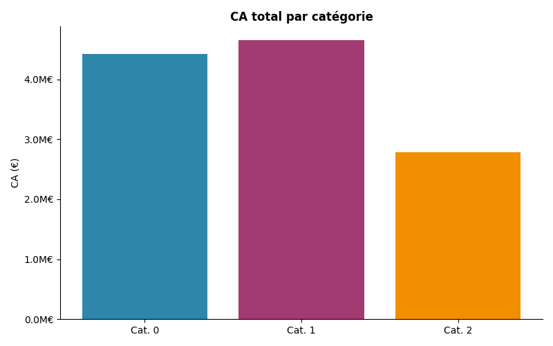
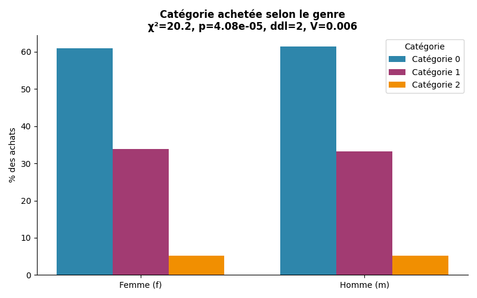

## Sommaire

:::: {.columns}
::: {.column width="25%"}
::: {.sommaire-card}
### 01 — Contexte
Périmètre, sources de données et questions structurantes
:::
:::
::: {.column width="25%"}
::: {.sommaire-card}
### 02 — Activité
CA, produits, transactions, BtoB et concentration du CA
:::
:::
::: {.column width="25%"}
::: {.sommaire-card}
### 03 — Corrélations
Genre, âge et comportements d'achat par catégorie
:::
:::
::: {.column width="25%"}
::: {.sommaire-card}
### 04 — Décisions
Synthèse et recommandations
:::
:::
::::

## Contexte & objectifs de l'analyse

:::: {.columns}
::: {.column width="58%"}
**Lapage** est une librairie e-commerce dont nous analysons **2 ans d'activité** pour identifier les leviers de croissance et les profils clients prioritaires.

**3 questions structurantes :**

- Comment évolue l'activité dans le temps ?
- Quels produits et clients génèrent la valeur ?
- Le profil client influence-t-il le comportement d'achat ?
:::
::: {.column width="42%"}
### Périmètre de l'analyse

- **Période** — Mars 2021 – Février 2023
- **Sources** — Clients, produits, transactions
- **Catalogue** — 3 catégories de livres
- **Clientèle** — BtoC & BtoB
- **Base** — 679 111 transactions, 8 596 clients
:::
::::

## +24 mois de hausse — la croissance est portée par le volume, le panier moyen reste stable

:::: {.columns}
::: {.column width="50%"}
{width=100%}
:::
::: {.column width="50%"}
### Chiffre d'affaires mensuel

- CA total sur 2 ans : **11,85 M€**
- Moyenne mensuelle : **494 k€**
- Tendance **haussière** sur toute la période
- Mois record : **Février 2022**
- Panier moyen **stable** à 17,35 € — la croissance est portée par le volume, pas les prix
:::
::::

## Catégorie 1 en tête — deux catégories quasi à égalité, la troisième décroche

:::: {.columns}
::: {.column width="50%"}
{width=100%}
:::
::: {.column width="50%"}
### Répartition par catégorie

- Catégorie 1 — **39,3 %** du CA (leader)
- Catégorie 0 — **37,3 %** du CA (quasi à égalité)
- Catégorie 2 — **23,5 %** du CA (décrochage)
- Risque modéré de dépendance — deux catégories dominent ensemble à **76,6 %**
:::
::::

## Transactions ∝ CA sur 24 mois — aucun effet prix dissocié détectable

:::: {.columns}
::: {.column width="50%"}
{width=100%}
:::
::: {.column width="50%"}
### Volume de transactions

- Total : **679 111 transactions** sur 2 ans
- Moyenne : **28 296 / mois**
- Volume corrélé au CA — **pas d'effet prix dissocié**
- Saisonnalité cohérente avec le CA
:::
::::

## Rotation constante — la même fraction du catalogue est active chaque mois

:::: {.columns}
::: {.column width="50%"}
{width=100%}
:::
::: {.column width="50%"}
### Rotation du catalogue

- Nombre de références actives **stable**
- Fraction **constante** du catalogue écoulée chaque mois
- Pas d'effet de renouvellement visible sur le CA
:::
::::

## Top 10 vs Flop 10 — un écart de CA massif, le catalogue doit être trié

:::: {.columns}
::: {.column width="50%"}
{width=100%}
:::
::: {.column width="50%"}
### Concentration produits

- Écart **significatif** entre best-sellers et queue de catalogue
- Les 10 premiers produits concentrent l'essentiel du CA
- Les produits en bas du classement génèrent peu de valeur et mobilisent des ressources
:::
::::

## BtoB : 4 clients, 7,4% du CA total — concentration critique à sécuriser

:::: {.columns}
::: {.column width="50%"}
{width=100%}
:::
::: {.column width="50%"}
### Segment BtoB

- Seuil BtoB identifié à **11 743 €** de CA cumulé
- Seulement **4 clients** franchissent ce seuil
- Ces 4 clients génèrent **881 k€**, soit **7,4 % du CA total**
- Risque de concentration **critique** — perte d'un client BtoB = impact direct et immédiat sur le CA
:::
::::

## Gini 0,45 — le CA est modérément concentré sur 20% des clients

:::: {.columns}
::: {.column width="50%"}
{width=100%}
:::
::: {.column width="50%"}
### Concentration du CA (Lorenz)

- Coefficient de Gini : **0,446**
- Les **20 %** de clients les plus dépensiers génèrent **48,4 %** du CA
- Concentration **modérée** — pas d'hyper-dépendance BtoC hors segment BtoB
- Base clients relativement saine
:::
::::

## Chi² significatif — le genre influence légèrement la catégorie achetée

:::: {.columns}
::: {.column width="50%"}
{width=100%}
:::
::: {.column width="50%"}
### Test Chi² d'indépendance

- Chi² = 20,2, **p < 0,001** — lien statistiquement significatif
- **V de Cramér faible** — l'effet est réel mais de petite taille
- Le genre influence marginalement les préférences de catégorie
- Segmentation par genre : **possible mais à faible ROI**
:::
::::

## Chi² fort — la tranche d'âge prédit la catégorie achetée

:::: {.columns}
::: {.column width="50%"}
{width=100%}
:::
::: {.column width="50%"}
### Test Chi² d'indépendance

- Chi² très élevé, **p < 0,001**, **V de Cramér fort**
- La tranche d'âge est un **prédicteur solide** de la catégorie achetée
- Levier direct pour le **ciblage éditorial** par groupe d'âge
- Recommandation : adapter les mises en avant catalogue selon l'âge
:::
::::

## r = −0,19 — les clients plus âgés dépensent légèrement moins

:::: {.columns}
::: {.column width="50%"}
{width=100%}
:::
::: {.column width="50%"}
### Corrélation de Pearson

- r = **−0,188**, p < 0,001 — corrélation négative **faible mais réelle**
- En moyenne : **−10,63 € de CA par année d'âge supplémentaire**
- L'effet existe mais il est de faible amplitude
- L'âge **ne suffit pas** à prédire la valeur client
:::
::::

## r ≈ 0 — l'âge ne prédit pas la fréquence d'achat

:::: {.columns}
::: {.column width="50%"}
{width=100%}
:::
::: {.column width="50%"}
### Corrélation de Pearson

- r = **0,030**, p = 0,005 — techniquement significatif
- Mais effet **négligeable en pratique** (r quasi nul)
- L'âge **ne détermine pas** la fréquence d'achat
- La fréquence est davantage liée à la **séniorité** (ρ = 0,546)
:::
::::

## r ≈ 0 — l'âge ne prédit pas le panier moyen

:::: {.columns}
::: {.column width="50%"}
{width=100%}
:::
::: {.column width="50%"}
### Corrélation de Pearson

- Aucune relation entre âge et panier moyen
- Le montant par transaction est **indépendant de l'âge**
- La **récurrence** prime sur le profil démographique pour expliquer la valeur client
:::
::::

## Synthèse — Principaux enseignements

:::: {.columns}
::: {.column width="50%"}
**Activité**

- ✅ CA en croissance sur 2 ans — 11,85 M€ au total
- ⚠️ Cat. 1 et Cat. 0 dominent à 76,6 % — Cat. 2 décroche
- ⚠️ Écart massif entre top produits et queue de catalogue

**Clients**

- ⚠️ 4 clients BtoB = 7,4 % du CA — risque de concentration critique
- ℹ️ Top 20 % des clients → 48,4 % du CA (Gini 0,446)
:::
::: {.column width="50%"}
**Corrélations**

- ✅ Tranche d'âge → prédicteur fort de la catégorie (V fort)
- ℹ️ Genre → effet significatif mais faible sur les catégories
- ℹ️ Âge → légère corrélation négative avec le CA (r = −0,19)
- ℹ️ Âge → aucun effet sur la fréquence ou le panier

**Signal fort**

- 🎯 La **tranche d'âge** — pas le genre — est le seul levier démographique actionnable
- 🎯 La **concentration BtoB** est le risque court terme n°1
:::
::::

## Recommandations — 4 actions prioritaires

:::: {.columns}
::: {.column width="50%"}
::: {.kpi-box}
🔴 **1 — Sécuriser le BtoB**
Suivi dédié, contrats cadres pour les 4 clients BtoB
*7,4 % du CA sur 4 comptes*
:::

::: {.kpi-box}
🔴 **2 — Cibler par tranche d'âge, pas par genre**
Adapter les mises en avant catalogue selon l'âge — prédicteur validé
*Chi² tranche d'âge × catégorie (V fort)*
:::
:::
::: {.column width="50%"}
::: {.kpi-box}
🟠 **3 — Réduire la queue de catalogue**
Déréférencer les produits en bas du classement, concentrer les efforts sur les références motrices
*Top 10 / Flop 10*
:::

::: {.kpi-box}
🟡 **4 — Développer la catégorie 2**
Analyser le décrochage (23,5 % du CA), levier de rééquilibrage du mix
*Répartition CA par catégorie*
:::
:::
::::
